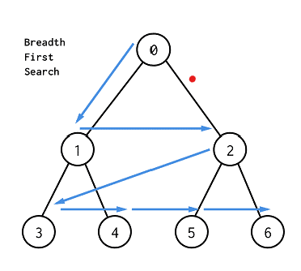

## 너비 우선 탐색이란?
BFS(Breadth First Search)

### 그래프
너비 우선탐색을 알기전에 우선 그래프라는 개념을 알 필요가 있다.

아래와 같은 그래프가 있을 시 너비 우선 탐색은 해당 너비를 구하기 위하여
0, 1, 2, 3, 4, 5, 6 순서대로 탐색을 한다.
즉 그래프에서 가장 가까운 노드부터 우선적으로 탐색하는 알고리즘이다.



## 너비 우선 탐색 플로우
1. 탐색 시작 노드를 큐에 삽입 & 방문처리
2. 큐를 노드에서 꺼내고, 해당 노드의 인접 노드 중 방문하지 않은 노드를 모두 큐에 삽입하고 방문처리
3. 더 이상 방문 할 정점이 없으면 한 depth 내려가서 다시 인접한 모든 정점들을 우선 방문한다.

```java
  val queue = LinkedList<Int>()
   // queue : 이웃 자식이 어떤 것인지 탐색하고 다음으로 찾아야 할 자식을 알아둡니다. 
     val visited = ArrayList<Vertex<T>>()
    //Visited : 어떤 정점이 접근되었는지 확인합니다. 
    
    fun bfs(start: Int) {
        queue.add(start)
        visited[start] = true

        while (queue.isNotEmpty()) {
            val head = queue.poll() // 첫 원소 반환 후 remove
            for (next in edges[head]) {
                if (!visited[next]) {
                    visited[next] = true
                    queue.add(next)
                }
            }
        }
    }
```


### 깊이 우선 탐색
DFS

## 플로우
1. 시작노드를 스택에 삽입 / 방문처리
2. 스택의 최상단 노드에 방문하지 않은 인접한 노드가 하나라도 있으면 그 노드를 스택에 넣고 방문처리한다.
3. 방문하지 않은 인접노드가 없으면 스택에서 최상단 노드를 꺼낸다.
4. 더 이상 2번의 과정을 수행할 수 없을 때까지 반복

```java
fun dfs(index: Int) {
        visited[index] = true
     
        // 구현
        for (next in edges[index]) {
            if (!visited[next]) {
                dfs(next)
            }
        }
    }
```