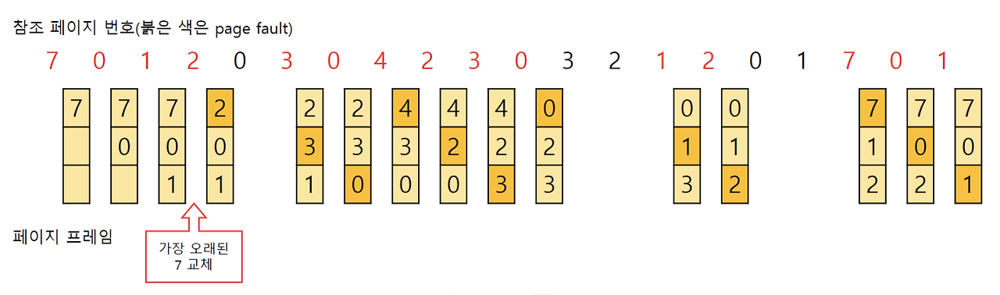
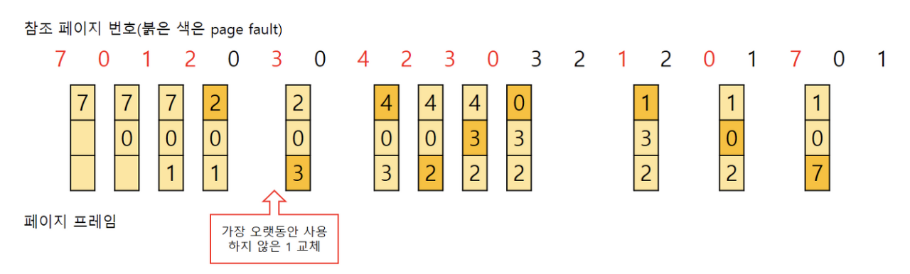

# Q. 다음 두 개의 그림을 보고 어떠한 페이지 교체 알고리즘을 사용하였는지 맞추시오

# 1

# 2

# 정답
FIFO 페이지 교체 알고리즘
- 해당 그림에서 메모리에 가장 먼저 올라온 페이지를 먼저 내보냈음
- 가장 간단한 방법

LRU 페이지 교체 알고리즘
- Least Recently Used
- 가장 오랫동안 사용하지 않은 페이지를 교체함으로 보아 LRU 알고리즘이다.
- 가장 오랫동안 사용하지 않았던 데이터라면 앞으로도 사용할 확률이 적을 것이라는 가정을 가진다.